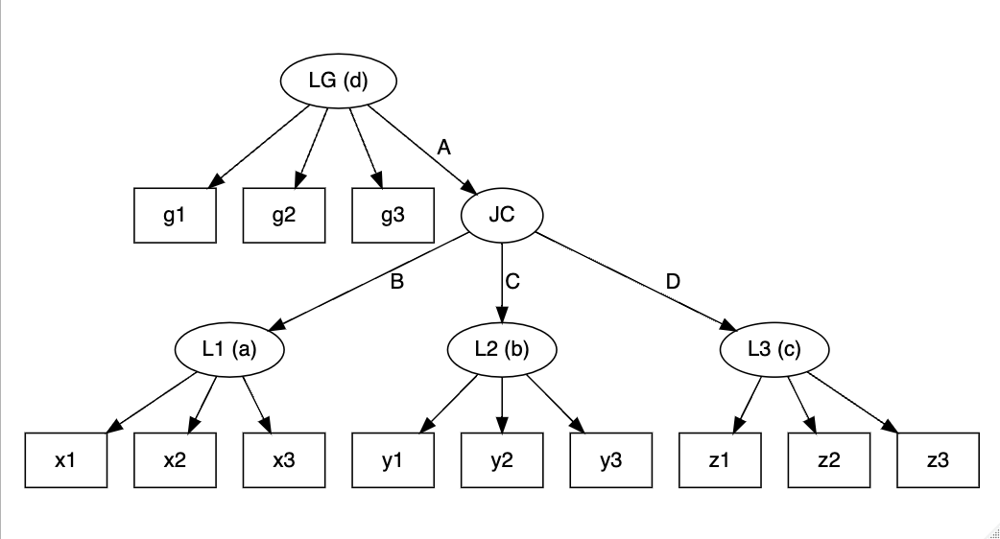

<!-- README.md is generated from README.Rmd. Please edit that file -->

# slca <a href="https://kim0sun.github.io/slca/"></a>

<!-- badges: start -->

[](https://CRAN.R-project.org/package=slca)
[](https://r-pkg.org/pkg/slca)
<!-- badges: end -->

`slca` provides comprehensive tools for the implementation of Structural
Latent Class Models (SLCM), including Latent Transition Analysis (LTA;
Linda M. Collins and Stephanie T. Lanza, 2009)
<doi:10.1002/9780470567333>, Latent Class Profile Analysis (LCPA; Hwan
Chung et al., 2010) <doi:10.1111/j.1467-985x.2010.00674.x>, and Joint
Latent Class Analysis (JLCA; Saebom Jeon et al., 2017)
<doi:10.1080/10705511.2017.1340844>, and any other extended models
involving multiple latent class variables.

## Installation

You can install the released version of slca from
[CRAN](https://CRAN.R-project.org) with:

``` r
install.packages("slca")
```

And the development version from [GitHub](https://github.com/) with:

``` r
# install.packages("devtools")
devtools::install_github("kim0sun/slca")
```

## Syntax

The function serves as the starting point for model specification.

``` r
slca(x, ..., constraints = NULL)
```

This primary function is crucial for forming the foundational structure
of your analysis, enabling a deep understanding of the intricate latent
structures within your dataset. The syntax is organized into two main
segments: the measurement model specification and the structural model
specification. This logical arrangement enhances the clarity and
efficacy of the model development process.

### Measurement model specification

Here, you delve into the heart of your model by defining latent class
variables. These are essentially unobserved variables inferred from
manifest indicators (observable variables). Each latent class variable
is represented alongside its number of classes, denoted in either
parentheses or brackets. For instance, you might define three classes
for latent class variable `L1` as `L1(3)`. Following syntax describes
three latent class variables with three classes each measured by `x`,
`y`, `z`.

``` r
L1(3) ~ x1 + x2 + x3
L2[3] ~ y1 + y2 + y3
L3(3) ~ z1 + z2 + z3
```


#### Structural model specification

This part focuses on establishing relationships between different latent
class variables. For example, `L1 ~ L2` indicates a relationship where
`L1` have impact on or related to `L2`, as shown below:

``` r
L1 ~ L2
```


In some cases, you might need to define higher-level latent class
variables that are influenced by or comprise several other latent class
variables. For example, a higher-level variable `P` could be a composite
of `L1`, `L2`, and `L3`. Here, note that you should define the number of
latent classes for `P`. This relationship can be represented as follows:

``` r
P[4] ~ L1 + L2 + L3
```


#### Parameter constraints

A critical aspect of model specification is ensuring measurement
invariance. This concept refers to the idea that the same latent
construct is being measured across different groups or time points. In
`slca`, you can assume measurement invariance by setting constraints on
your latent class variables. The `constraints` argument is used to
specify which latent class variables should be measured in a homogeneous
manner. This feature is crucial for comparative studies where you need
to ensure that the measurement properties of your constructs are
consistent across different sub-groups or over time.

``` r
slca(L1[3] ~ x11 + x21 + x31, 
     L2[3] ~ x12 + x22 + x32, 
     L3[3] ~ x13 + x23 + x33,
     P[3] ~ L1 + L2 + L3, 
     constraints = c("L1", "L2", "L3"))
```

If the model needs to be constrained for the transition probabilities to
be homogeneous, you can use `~` or `->` to represent the relationships
you want to indicate, as follows:

``` r
slca(L1[3] ~ x11 + x21 + x31, 
     L2[3] ~ x12 + x22 + x32, 
     L3[3] ~ x13 + x23 + x33,
     constraints = c("L1 ~ L2", "L2 -> L3"))
```

## Model Examples

``` r
library(slca)
lta <- slca(L1[3] ~ x1 + y1 + z1, L2[3] ~ x2 + y2 + z2, L3[3] ~ x3 + y3 + z3,
            L1 ~ L2, L2 ~ L3, constraints = c("L1", "L2", "L3"))
plot(lta)
```


``` r
jlca <- slca(L1[3] ~ x1 + x2 + x3, L2[3] ~ y1 + y2 + y3, L3[3] ~ z1 + z2 + z3,
             JC[3] ~ L1 + L2 + L3)
plot(jlca)
```


``` r
lcamg <- slca(L1[3] ~ x1 + x2 + x3, L2[3] ~ y1 + y2 + y3, L3[3] ~ z1 + z2 + z3,
              JC[3] ~ L1 + L2 + L3, LG[3] ~ g1 + g2 + g3, 
              LG ~ JC)
plot(lcamg)
```


