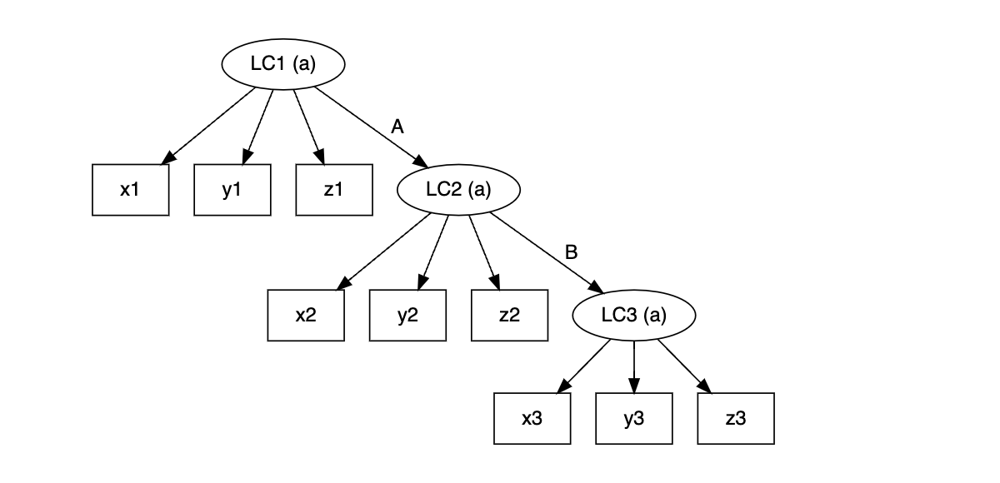
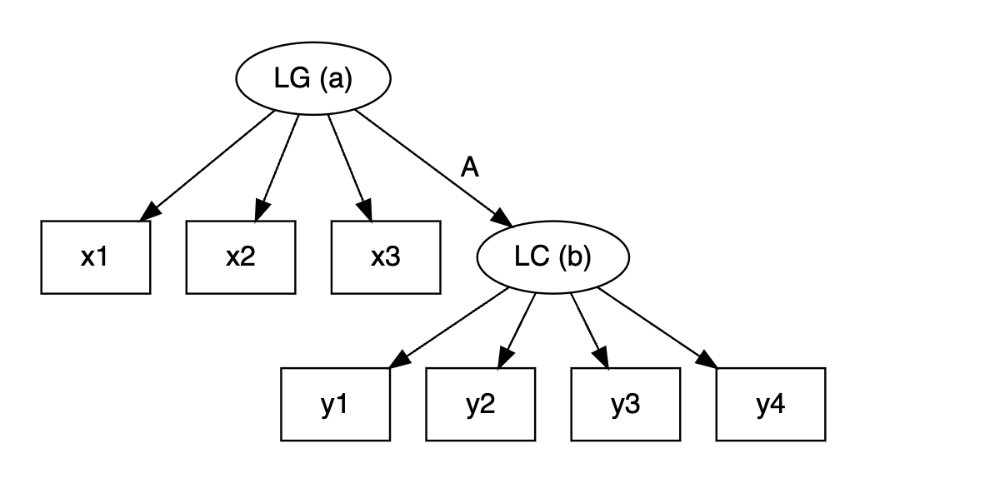
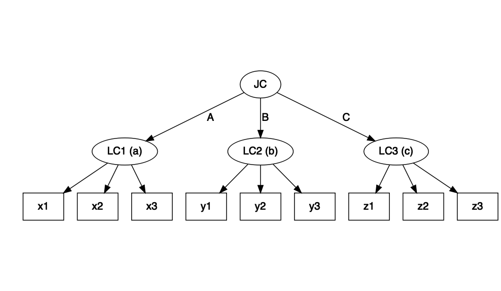
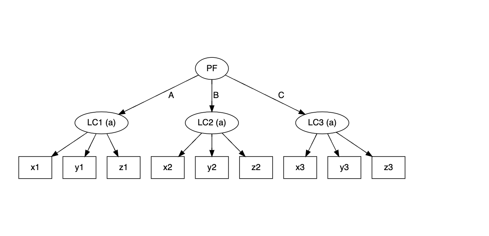
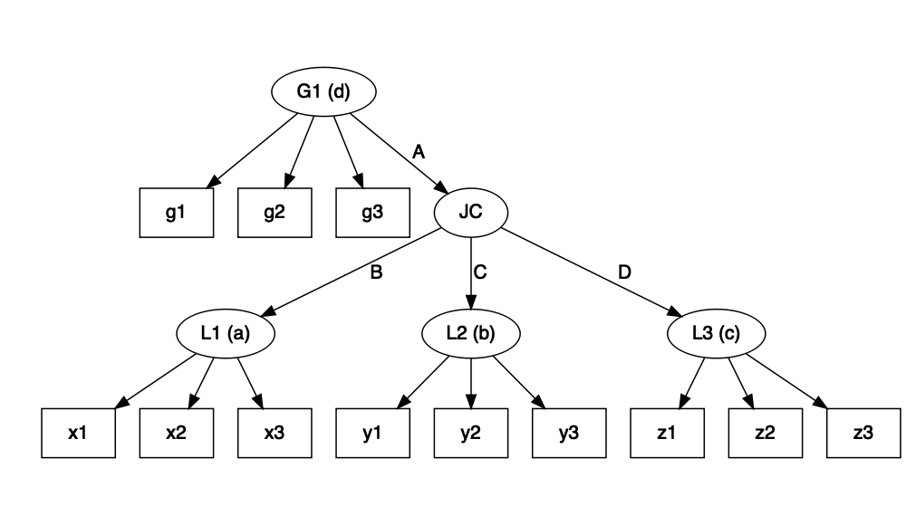
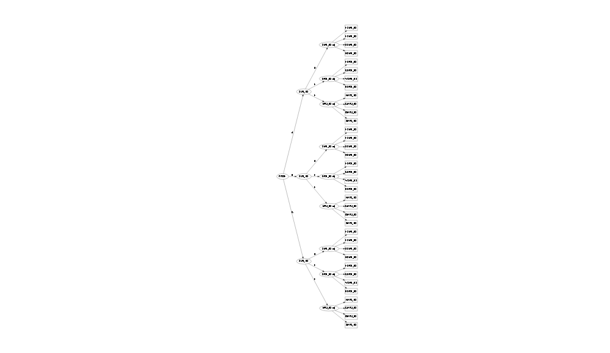
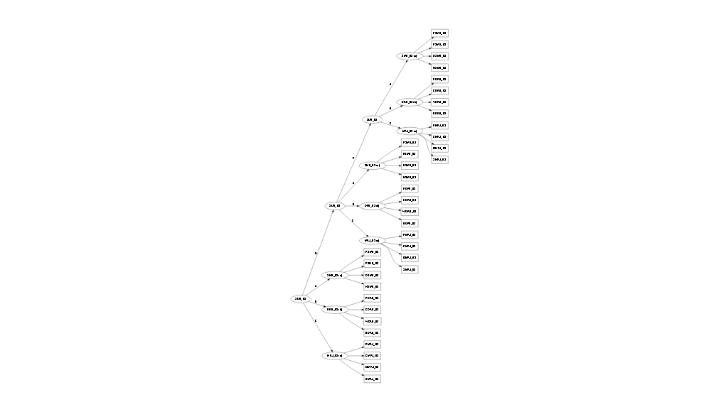

```r
# install.packages("slca")
library(slca)
library(magrittr)
# examples for model construction
lta1 <- slca(LC1[3] ~ x1 + y1 + z1,
             LC2[3] ~ x2 + y2 + z2,
             LC3[3] ~ x3 + y3 + z3,
             LC1 ~ LC2, LC2 ~ LC3,
             constraints = c("LC1", "LC2", "LC3"))

lta2 <- slca(LG[2] ~ x1 + x2 + x3,
             LC[3] ~ y1 + y2 + y3 + y4,
             LG ~ LC)

lta1
```

```
## Structural Latent Variable Model
## 
## Latent variables (Root*):                    
##  Label: LC1* LC2 LC3
## nclass: 3    3   3  
## 
## Measurement model:                         
##  LC1 -> { x1, y1, z1 }  a
##  LC2 -> { x2, y2, z2 }  a
##  LC3 -> { x3, y3, z3 }  a
## 
## Structural model:               
##  LC1 -> { LC2 }
##  LC2 -> { LC3 }
## 
## Dependency constraints:
##  A          B         
##  LC1 -> LC2 LC2 -> LC3
```

```r
lta2
```

```
## Structural Latent Variable Model
## 
## Latent variables (Root*):              
##  Label: LG* LC
## nclass: 2   3 
## 
## Measurement model:                            
##  LG -> { x1, x2, x3 }      a
##  LC -> { y1, y2, y3, y4 }  b
## 
## Structural model:             
##  LG -> { LC }
## 
## Dependency constraints:
##  A       
##  LG -> LC
```

```r
## Figure 1
plot(lta1); plot(lta2)
```



```r
jlca <- slca(LC1[3] ~ x1 + x2 + x3,
             LC2[2] ~ y1 + y2 + y3,
             LC3[4] ~ z1 + z2 + z3,
             JC[3] ~ LC1 + LC2 + LC3)
lcpa <- slca(LC1[3] ~ x1 + y1 + z1,
             LC2[3] ~ x2 + y2 + z2,
             LC3[3] ~ x3 + y3 + z3,
             PF[3] ~ LC1 + LC2 + LC3,
             constraints = c("LC1", "LC2", "LC3"))

jlca
```

```
## Structural Latent Variable Model
## 
## Latent variables (Root*):                       
##  Label: LC1 LC2 LC3 JC*
## nclass: 3   2   4   3  
## 
## Measurement model:                         
##  LC1 -> { x1, x2, x3 }  a
##  LC2 -> { y1, y2, y3 }  b
##  LC3 -> { z1, z2, z3 }  c
## 
## Structural model:                        
##  JC -> { LC1, LC2, LC3 }
## 
## Dependency constraints:
##  A         B         C        
##  JC -> LC1 JC -> LC2 JC -> LC3
```

```r
lcpa
```

```
## Structural Latent Variable Model
## 
## Latent variables (Root*):                       
##  Label: LC1 LC2 LC3 PF*
## nclass: 3   3   3   3  
## 
## Measurement model:                         
##  LC1 -> { x1, y1, z1 }  a
##  LC2 -> { x2, y2, z2 }  a
##  LC3 -> { x3, y3, z3 }  a
## 
## Structural model:                        
##  PF -> { LC1, LC2, LC3 }
## 
## Dependency constraints:
##  A         B         C        
##  PF -> LC1 PF -> LC2 PF -> LC3
```

```r
## Figure 2
plot(jlca); plot(lcpa)
```



```r
## Figure 3
model <- slca(L1[3] ~ x1 + x2 + x3,
              L2[4] ~ y1 + y2 + y3,
              L3[2] ~ z1 + z2 + z3,
              G1[3] ~ g1 + g2 + g3,
              JC[3] ~ L1 + L2 + L3,
              G1 ~ JC)
plot(model)
```



```r
# Example 1 (gss7677 data)
set.seed(0)
## LC model for tolerance to minority (TOL)
m2 <- slca(TOL(2) ~ TOLRAC + TOLCOM + TOLHOMO + TOLATH + TOLMIL) %>%
   estimate(data = gss7677)
m3 <- slca(TOL(3) ~ TOLRAC + TOLCOM + TOLHOMO + TOLATH + TOLMIL) %>%
   estimate(data = gss7677)
m4 <- slca(TOL(4) ~ TOLRAC + TOLCOM + TOLHOMO + TOLATH + TOLMIL) %>%
   estimate(data = gss7677)
m5 <- slca(TOL(5) ~ TOLRAC + TOLCOM + TOLHOMO + TOLATH + TOLMIL) %>%
   estimate(data = gss7677, control = list(em.iterlim = 10000))

## model selection including bootstrap test (takes long time)
gof(m2, m3, m4, m5, test = "boot")
```

```
## Analysis of Goodness of Fit Table
## 
##    Df  logLik   AIC   BIC     Gsq Res. Df Pr(Boot)    
## m2 11 -6856.9 13736 13802 251.808      20   <2e-16 ***
## m3 17 -6760.3 13554 13656  58.485      14   <2e-16 ***
## m4 23 -6734.2 13514 13652   6.435       8     0.79    
## m5 29 -6732.5 13523 13697   2.948       2     0.89    
## ---
## Signif. codes:  0 '***' 0.001 '**' 0.01 '*' 0.05 '.' 0.1 ' ' 1
```

```r
compare(m4, m5, test = "boot")
```

```
## Analysis of Relative Model Fit
## 
## Model H0: m4
## Model H1: m5
##    Df  logLik   AIC   BIC    Gsq Res. Df Pr(Boot)
## m4 23 -6734.2 13514 13652                        
## m5 29 -6732.5 13523 13697 3.4867       6     0.24
```

```r
## reorder and print parameters (to better description)
m4 <- m4 %>% reorder(TOL = c(1, 4, 3, 2))
param(m4)
```

```
## PI :
## (TOL)
##   class
##          1       2       3       4
##     0.2129  0.0989  0.1171  0.5711
## 
## RHO :
## (a)
##         class
## response       1       2       3       4
##    1(V1)  0.9138  0.0000  0.7495  0.0719
##    2      0.0862  1.0000  0.2505  0.9281
##    1(V2)  0.9447  0.6683  0.2534  0.0438
##    2      0.0553  0.3317  0.7466  0.9562
##    1(V3)  0.9552  0.7453  0.5621  0.1378
##    2      0.0448  0.2547  0.4379  0.8622
##    1(V4)  0.9812  0.4212  0.6031  0.0357
##    2      0.0188  0.5788  0.3969  0.9643
##    1(V5)  0.9143  0.3755  0.3912  0.0551
##    2      0.0857  0.6245  0.6088  0.9449
## 
##     V1     V2     V3      V4     V5    
## TOL TOLRAC TOLCOM TOLHOMO TOLATH TOLMIL
```

```r
## regression on covariates
m4 %>% regress(TOL ~ PADEG, data = gss7677)
```

```
## Coefficients:     
## class  (Intercept)  PADEGHIGH-SCH  PADEGCOLLEGE  PADEGBACHELOR
##   1/4   -1.419        1.295          1.573         2.326      
##   2/4   -2.078        0.891          0.287         1.340      
##   3/4   -2.156        0.327        -10.266         0.119      
##      
## class  PADEGGRADUATE
##   1/4    2.236      
##   2/4    1.213      
##   3/4    0.598
```

```r
m4 %>% regress(TOL ~ MADEG, data = gss7677)
```

```
## Coefficients:     
## class  (Intercept)  MADEGHIGH-SCH  MADEGCOLLEGE  MADEGBACHELOR
##   1/4   -1.6068       1.5465         2.0485        2.3377     
##   2/4   -2.1565       1.0491         1.3453        0.9778     
##   3/4   -2.2034       0.7506       -11.8850        0.5549     
##      
## class  MADEGGRADUATE
##   1/4    2.2998     
##   2/4    0.0763     
##   3/4  -11.6598
```

```r
m4 %>% regress(TOL ~ PAPRES, data = gss7677)
```

```
## Coefficients:     
## class  (Intercept)  PAPRESMIDIUM  PAPRESHIGH
##   1/4  -1.1281       0.0991        1.3617   
##   2/4  -1.8707      -0.0657        0.6002   
##   3/4  -1.8563      -0.4495        0.2981
```

```r
## LC model for social status (STATUS)
m3 <- slca(STATUS(3) ~ PAPRES + PADEG + MADEG) %>%
   estimate(data = gss7677)

## print parameters
param(m3)
```

```
## PI :
## (STATUS)
##   class
##          1       2       3
##     0.0571  0.2606  0.6823
## 
## RHO :
## (a)
##         class
## response       1       2       3
##    1(V1)  0.0000  0.2256  0.3599
##    2      0.3685  0.6888  0.6294
##    3      0.6315  0.0856  0.0107
##    1(V2)  0.0000  0.0961  0.9545
##    2      0.0000  0.8431  0.0421
##    3      0.0406  0.0048  0.0034
##    4      0.4277  0.0561  0.0000
##    5      0.5317  0.0000  0.0000
##    1(V3)  0.1289  0.1678  0.8333
##    2      0.4471  0.7455  0.1556
##    3      0.0090  0.0280  0.0036
##    4      0.3029  0.0503  0.0065
##    5      0.1121  0.0084  0.0011
## 
##        V1     V2    V3   
## STATUS PAPRES PADEG MADEG
```

```r
## latent transition analysis with TOL and STATUS
lta <- slca(
   STATUS(3) ~ PAPRES + PADEG + MADEG,
   TOL(4) ~ TOLRAC + TOLCOM + TOLHOMO + TOLATH + TOLMIL,
   STATUS ~ TOL
) %>% estimate(data = gss7677)

## reorder and print parameters (to better description)
lta <- lta %>% reorder(TOL = c(1, 3, 4, 2),
                       STATUS = c(2, 1, 3))
param(lta)
```

```
## PI :
## (STATUS)
##   class
##          1       2       3
##     0.0612  0.3105  0.6283
## 
## TAU :
## (A)
##      parent
## child       1       2       3
##     1  0.5947  0.3925  0.0988
##     2  0.1623  0.2437  0.1070
##     3  0.0477  0.1099  0.0918
##     4  0.1953  0.2539  0.7024
##              
## parent STATUS
## child  TOL   
## 
## RHO :
## (a)
##         class
## response       1       2       3
##    1(V1)  0.0001  0.2538  0.3592
##    2      0.3762  0.6772  0.6312
##    3      0.6237  0.0690  0.0096
##    1(V2)  0.0000  0.2836  0.9410
##    2      0.0515  0.6698  0.0564
##    3      0.0382  0.0060  0.0026
##    4      0.4222  0.0406  0.0000
##    5      0.4881  0.0000  0.0000
##    1(V3)  0.1306  0.1377  0.9102
##    2      0.4563  0.7782  0.0858
##    3      0.0130  0.0269  0.0017
##    4      0.2926  0.0488  0.0024
##    5      0.1076  0.0085  0.0000
## 
##        V1     V2    V3   
## STATUS PAPRES PADEG MADEG
## (b)
##         class
## response       1       2       3       4
##    1(V1)  0.8860  0.0000  0.9197  0.0771
##    2      0.1140  1.0000  0.0803  0.9229
##    1(V2)  0.9318  0.4698  0.2812  0.0337
##    2      0.0682  0.5302  0.7188  0.9663
##    1(V3)  0.9572  0.6649  0.5603  0.1048
##    2      0.0428  0.3351  0.4397  0.8952
##    1(V4)  0.9815  0.3340  0.6003  0.0324
##    2      0.0185  0.6660  0.3997  0.9676
##    1(V5)  0.9154  0.2810  0.3819  0.0531
##    2      0.0846  0.7190  0.6181  0.9469
## 
##     V1     V2     V3      V4     V5    
## TOL TOLRAC TOLCOM TOLHOMO TOLATH TOLMIL
```

```r
# Example 2 (addhealth data)
set.seed(0)
## LC model for adolescents depression (DEP1, DEP2)
lta2 <- slca(
   DEP1(2) ~ S1w1 + S2w1 + S3w1 + S4w1 + D1w1 + D2w1 + F1w1 + F2w1,
   DEP2(2) ~ S1w2 + S2w2 + S3w2 + S4w2 + D1w2 + D2w2 + F1w2 + F2w2,
   DEP1 ~ DEP2
) %>% estimate(data = addhealth)
lta3 <- slca(
   DEP1(3) ~ S1w1 + S2w1 + S3w1 + S4w1 + D1w1 + D2w1 + F1w1 + F2w1,
   DEP2(3) ~ S1w2 + S2w2 + S3w2 + S4w2 + D1w2 + D2w2 + F1w2 + F2w2,
   DEP1 ~ DEP2
) %>% estimate(data = addhealth)
lta4 <- slca(
   DEP1(4) ~ S1w1 + S2w1 + S3w1 + S4w1 + D1w1 + D2w1 + F1w1 + F2w1,
   DEP2(4) ~ S1w2 + S2w2 + S3w2 + S4w2 + D1w2 + D2w2 + F1w2 + F2w2,
   DEP1 ~ DEP2
) %>% estimate(data = addhealth)
lta5 <- slca(
   DEP1(5) ~ S1w1 + S2w1 + S3w1 + S4w1 + D1w1 + D2w1 + F1w1 + F2w1,
   DEP2(5) ~ S1w2 + S2w2 + S3w2 + S4w2 + D1w2 + D2w2 + F1w2 + F2w2,
   DEP1 ~ DEP2
) %>% estimate(data = addhealth)
lta6 <- slca(
   DEP1(6) ~ S1w1 + S2w1 + S3w1 + S4w1 + D1w1 + D2w1 + F1w1 + F2w1,
   DEP2(6) ~ S1w2 + S2w2 + S3w2 + S4w2 + D1w2 + D2w2 + F1w2 + F2w2,
   DEP1 ~ DEP2
) %>% estimate(data = addhealth)

## model selection
gof(lta2, lta3, lta4, lta5, lta6)
```

```
## Analysis of Goodness of Fit Table
## 
##       Df logLik   AIC   BIC    Gsq Res. Df
## lta2  35 -15281 30632 30830 6925.3   65500
## lta3  56 -14896 29904 30219 6154.3   65479
## lta4  79 -14647 29452 29896 5656.5   65456
## lta5 104 -14514 29235 29821 5389.8   65431
## lta6 131 -14460 29181 29919 5281.8   65404
```

```r
## test for measurement invariance assumption
lta5inv <- slca(
   DEP1(5) ~ S1w1 + S2w1 + S3w1 + S4w1 + D1w1 + D2w1 + F1w1 + F2w1,
   DEP2(5) ~ S1w2 + S2w2 + S3w2 + S4w2 + D1w2 + D2w2 + F1w2 + F2w2,
   DEP1 ~ DEP2, constraints = c("DEP1", "DEP2")
) %>% estimate(data = addhealth)
compare(lta5, lta5inv, test = "chisq")
```

```
## Analysis of Relative Model Fit
## 
## Model H0: lta5inv
## Model H1: lta5
##          Df logLik   AIC   BIC    Gsq Res. Df Pr(>Chi)
## lta5inv  64 -14535 29197 29558                        
## lta5    104 -14514 29235 29821 42.332      40   0.3707
```

```r
## print parameters
param(lta5inv)
```

```
## PI :
## (DEP1)
##   class
##          1       2       3       4       5
##     0.3632  0.1826  0.1128  0.2307  0.1106
## 
## TAU :
## (A)
##      parent
## child       1       2       3       4       5
##     1  0.7543  0.2499  0.0325  0.3024  0.0808
##     2  0.0857  0.4739  0.1650  0.0412  0.0297
##     3  0.0206  0.1716  0.3595  0.0679  0.1408
##     4  0.1242  0.0478  0.3350  0.5442  0.1576
##     5  0.0152  0.0569  0.1081  0.0444  0.5911
##            
## parent DEP1
## child  DEP2
## 
## RHO :
## (a)
##         class
## response       1       2       3       4       5
##    1(V1)  0.0342  0.1184  0.6930  0.5150  0.8118
##    2      0.9658  0.8816  0.3070  0.4850  0.1882
##    1(V2)  0.0568  0.1826  0.8401  0.6799  0.9393
##    2      0.9432  0.8174  0.1599  0.3201  0.0607
##    1(V3)  0.0640  0.2704  0.8385  0.5458  0.8472
##    2      0.9360  0.7296  0.1615  0.4542  0.1528
##    1(V4)  0.1067  0.3407  0.9198  0.7948  0.9423
##    2      0.8933  0.6593  0.0802  0.2052  0.0577
##    1(V5)  0.0912  0.6809  0.7641  0.1603  0.6491
##    2      0.9088  0.3191  0.2359  0.8397  0.3509
##    1(V6)  0.0271  0.6705  0.8826  0.1253  0.7926
##    2      0.9729  0.3295  0.1174  0.8747  0.2074
##    1(V7)  0.0136  0.0767  0.1260  0.1297  0.8885
##    2      0.9864  0.9233  0.8740  0.8703  0.1115
##    1(V8)  0.0034  0.0475  0.0576  0.0554  0.6961
##    2      0.9966  0.9525  0.9424  0.9446  0.3039
## 
##      V1   V2   V3   V4   V5   V6   V7   V8  
## DEP1 S1w1 S2w1 S3w1 S4w1 D1w1 D2w1 F1w1 F2w1
## DEP2 S1w2 S2w2 S3w2 S4w2 D1w2 D2w2 F1w2 F2w2
```

```r
## reorder latent classes and restrict paremeters to zero
lta5inv <- lta5inv %>% reorder(DEP1 = c(1, 4, 2, 3, 5))
lta5inv %>% param()
```

```
## PI :
## (DEP1)
##   class
##          1       2       3       4       5
##     0.3632  0.2307  0.1826  0.1128  0.1106
## 
## TAU :
## (A)
##      parent
## child       1       2       3       4       5
##     1  0.7543  0.3024  0.2499  0.0325  0.0808
##     2  0.1242  0.5442  0.0478  0.3350  0.1576
##     3  0.0857  0.0412  0.4739  0.1650  0.0297
##     4  0.0206  0.0679  0.1716  0.3595  0.1408
##     5  0.0152  0.0444  0.0569  0.1081  0.5911
##            
## parent DEP1
## child  DEP2
## 
## RHO :
## (a)
##         class
## response       1       2       3       4       5
##    1(V1)  0.0342  0.5150  0.1184  0.6930  0.8118
##    2      0.9658  0.4850  0.8816  0.3070  0.1882
##    1(V2)  0.0568  0.6799  0.1826  0.8401  0.9393
##    2      0.9432  0.3201  0.8174  0.1599  0.0607
##    1(V3)  0.0640  0.5458  0.2704  0.8385  0.8472
##    2      0.9360  0.4542  0.7296  0.1615  0.1528
##    1(V4)  0.1067  0.7948  0.3407  0.9198  0.9423
##    2      0.8933  0.2052  0.6593  0.0802  0.0577
##    1(V5)  0.0912  0.1603  0.6809  0.7641  0.6491
##    2      0.9088  0.8397  0.3191  0.2359  0.3509
##    1(V6)  0.0271  0.1253  0.6705  0.8826  0.7926
##    2      0.9729  0.8747  0.3295  0.1174  0.2074
##    1(V7)  0.0136  0.1297  0.0767  0.1260  0.8885
##    2      0.9864  0.8703  0.9233  0.8740  0.1115
##    1(V8)  0.0034  0.0554  0.0475  0.0576  0.6961
##    2      0.9966  0.9446  0.9525  0.9424  0.3039
## 
##      V1   V2   V3   V4   V5   V6   V7   V8  
## DEP1 S1w1 S2w1 S3w1 S4w1 D1w1 D2w1 F1w1 F2w1
## DEP2 S1w2 S2w2 S3w2 S4w2 D1w2 D2w2 F1w2 F2w2
```

```r
lta5inv %>% param(index = TRUE)
```

```
## PI :
## (DEP1)
##   class
##              1           2           3           4           5
##     0.3632 (1)  0.2307 (2)  0.1826 (3)  0.1128 (4)  0.1106 (5)
## 
## TAU :
## (A)
##      parent
## child            1            2            3            4            5
##     1   0.7543 (6)  0.3024 (11)  0.2499 (16)  0.0325 (21)  0.0808 (26)
##     2   0.1242 (7)  0.5442 (12)  0.0478 (17)  0.3350 (22)  0.1576 (27)
##     3   0.0857 (8)  0.0412 (13)  0.4739 (18)  0.1650 (23)  0.0297 (28)
##     4   0.0206 (9)  0.0679 (14)  0.1716 (19)  0.3595 (24)  0.1408 (29)
##     5  0.0152 (10)  0.0444 (15)  0.0569 (20)  0.1081 (25)  0.5911 (30)
##            
## parent DEP1
## child  DEP2
## 
## RHO :
## (a)
##         class
## response            1            2            3            4             5
##    1(V1)  0.0342 (31)  0.5150 (47)  0.1184 (63)  0.6930 (79)   0.8118 (95)
##    2      0.9658 (32)  0.4850 (48)  0.8816 (64)  0.3070 (80)   0.1882 (96)
##    1(V2)  0.0568 (33)  0.6799 (49)  0.1826 (65)  0.8401 (81)   0.9393 (97)
##    2      0.9432 (34)  0.3201 (50)  0.8174 (66)  0.1599 (82)   0.0607 (98)
##    1(V3)  0.0640 (35)  0.5458 (51)  0.2704 (67)  0.8385 (83)   0.8472 (99)
##    2      0.9360 (36)  0.4542 (52)  0.7296 (68)  0.1615 (84)  0.1528 (100)
##    1(V4)  0.1067 (37)  0.7948 (53)  0.3407 (69)  0.9198 (85)  0.9423 (101)
##    2      0.8933 (38)  0.2052 (54)  0.6593 (70)  0.0802 (86)  0.0577 (102)
##    1(V5)  0.0912 (39)  0.1603 (55)  0.6809 (71)  0.7641 (87)  0.6491 (103)
##    2      0.9088 (40)  0.8397 (56)  0.3191 (72)  0.2359 (88)  0.3509 (104)
##    1(V6)  0.0271 (41)  0.1253 (57)  0.6705 (73)  0.8826 (89)  0.7926 (105)
##    2      0.9729 (42)  0.8747 (58)  0.3295 (74)  0.1174 (90)  0.2074 (106)
##    1(V7)  0.0136 (43)  0.1297 (59)  0.0767 (75)  0.1260 (91)  0.8885 (107)
##    2      0.9864 (44)  0.8703 (60)  0.9233 (76)  0.8740 (92)  0.1115 (108)
##    1(V8)  0.0034 (45)  0.0554 (61)  0.0475 (77)  0.0576 (93)  0.6961 (109)
##    2      0.9966 (46)  0.9446 (62)  0.9525 (78)  0.9424 (94)  0.3039 (110)
## 
##      V1   V2   V3   V4   V5   V6   V7   V8  
## DEP1 S1w1 S2w1 S3w1 S4w1 D1w1 D2w1 F1w1 F2w1
## DEP2 S1w2 S2w2 S3w2 S4w2 D1w2 D2w2 F1w2 F2w2
```

```r
lta5fix <- lta5inv %>% estimate(fix2zero = c(13, 17))

## test for parameter constraints (fix to zero)
compare(lta5inv, lta5fix, test = "chisq")
```

```
## Analysis of Relative Model Fit
## 
## Model H0: lta5fix
## Model H1: lta5inv
##         Df logLik   AIC   BIC    Gsq Res. Df Pr(>Chi)  
## lta5fix 62 -14538 29199 29548                          
## lta5inv 64 -14535 29197 29558 5.7944       2  0.05518 .
## ---
## Signif. codes:  0 '***' 0.001 '**' 0.01 '*' 0.05 '.' 0.1 ' ' 1
```

```r
# Example 3 (nlsy97 data)
set.seed(0)
names(nlsy97)
```

```
##  [1] "SEX"     "RACE"    "ESMK_98" "FSMK_98" "DSMK_98" "HSMK_98" "EDRK_98"
##  [8] "CDRK_98" "WDRK_98" "BDRK_98" "EMRJ_98" "CMRJ_98" "OMRJ_98" "SMRJ_98"
## [15] "ESMK_03" "FSMK_03" "DSMK_03" "HSMK_03" "EDRK_03" "CDRK_03" "WDRK_03"
## [22] "BDRK_03" "EMRJ_03" "CMRJ_03" "OMRJ_03" "SMRJ_03" "ESMK_08" "FSMK_08"
## [29] "DSMK_08" "HSMK_08" "EDRK_08" "CDRK_08" "WDRK_08" "BDRK_08" "EMRJ_08"
## [36] "CMRJ_08" "OMRJ_08" "SMRJ_08"
```

```r
## joint latent class profile model for substance use
jlcpa <- slca(
   # Smoking behavior at each time point
   SMK_98(3) ~ ESMK_98 + FSMK_98 + DSMK_98 + HSMK_98,
   SMK_03(3) ~ ESMK_03 + FSMK_03 + DSMK_03 + HSMK_03,
   SMK_08(3) ~ ESMK_08 + FSMK_08 + DSMK_08 + HSMK_08,
   # Drinking behavior at each time point
   DRK_98(3) ~ EDRK_98 + CDRK_98 + WDRK_98 + BDRK_98,
   DRK_03(3) ~ EDRK_03 + CDRK_03 + WDRK_03 + BDRK_03,
   DRK_08(3) ~ EDRK_08 + CDRK_08 + WDRK_08 + BDRK_08,
   # Marijuana use behavior at each time point
   MRJ_98(3) ~ EMRJ_98 + CMRJ_98 + OMRJ_98 + SMRJ_98,
   MRJ_03(3) ~ EMRJ_03 + CMRJ_03 + OMRJ_03 + SMRJ_03,
   MRJ_08(3) ~ EMRJ_08 + CMRJ_08 + OMRJ_08 + SMRJ_08,
   # Overall substance use behavior at each time point
   SUB_98(5) ~ SMK_98 + DRK_98 + MRJ_98,
   SUB_03(5) ~ SMK_03 + DRK_03 + MRJ_03,
   SUB_08(5) ~ SMK_08 + DRK_08 + MRJ_08,
   # Longitudinal shifts of overall substance use behavior
   PROF(4) ~ SUB_98 + SUB_03 + SUB_08,
   # Measurement invariance of latent class variables
   constraints = list(
      c("SMK_98", "SMK_03", "SMK_08"),
      c("DRK_98", "DRK_03", "DRK_08"),
      c("MRJ_98", "MRJ_03", "MRJ_08"),
      c("SUB_98 ~ SMK_98", "SUB_03 ~ SMK_03", "SUB_08 ~ SMK_08"),
      c("SUB_98 ~ DRK_98", "SUB_03 ~ DRK_03", "SUB_08 ~ DRK_08"),
      c("SUB_98 ~ MRJ_98", "SUB_03 ~ MRJ_03", "SUB_08 ~ MRJ_08")
   )
)
jlcpa
```

```
## Structural Latent Variable Model
## 
## Latent variables (Root*):                                                                      
##  Label: SMK_98 SMK_03 SMK_08 DRK_98 DRK_03 DRK_08 MRJ_98 MRJ_03 MRJ_08
## nclass: 3      3      3      3      3      3      3      3      3     
##                                   
##  Label: SUB_98 SUB_03 SUB_08 PROF*
## nclass: 5      5      5      4    
## 
## Measurement model:                                                    
##  SMK_98 -> { ESMK_98, FSMK_98, DSMK_98, HSMK_98 }  a
##  SMK_03 -> { ESMK_03, FSMK_03, DSMK_03, HSMK_03 }  a
##  SMK_08 -> { ESMK_08, FSMK_08, DSMK_08, HSMK_08 }  a
##  DRK_98 -> { EDRK_98, CDRK_98, WDRK_98, BDRK_98 }  b
##  DRK_03 -> { EDRK_03, CDRK_03, WDRK_03, BDRK_03 }  b
##  DRK_08 -> { EDRK_08, CDRK_08, WDRK_08, BDRK_08 }  b
##  MRJ_98 -> { EMRJ_98, CMRJ_98, OMRJ_98, SMRJ_98 }  c
##  MRJ_03 -> { EMRJ_03, CMRJ_03, OMRJ_03, SMRJ_03 }  c
##  MRJ_08 -> { EMRJ_08, CMRJ_08, OMRJ_08, SMRJ_08 }  c
## 
## Structural model:                                     
##  SUB_98 -> { SMK_98, DRK_98, MRJ_98 }
##  SUB_03 -> { SMK_03, DRK_03, MRJ_03 }
##  SUB_08 -> { SMK_08, DRK_08, MRJ_08 }
##  PROF   -> { SUB_98, SUB_03, SUB_08 }
## 
## Dependency constraints:
##  A              B              C              D               
##  PROF -> SUB_98 PROF -> SUB_03 PROF -> SUB_08 SUB_98 -> SMK_98
##                                               SUB_03 -> SMK_03
##                                               SUB_08 -> SMK_08
##  E                F               
##  SUB_98 -> DRK_98 SUB_98 -> MRJ_98
##  SUB_03 -> DRK_03 SUB_03 -> MRJ_03
##  SUB_08 -> DRK_08 SUB_08 -> MRJ_08
```

```r
jlcpa_fit <- estimate(jlcpa, data = nlsy97)

## reorder and print parameters (to better description)
jlcpa_fit <- jlcpa_fit %>% reorder(
   SMK_98 = c(1, 3, 2),
   DRK_98 = c(3, 2, 1),
   MRJ_98 = c(3, 1, 2),
   SUB_98 = c(3, 4, 5, 1, 2),
   PROF = c(4, 1, 3, 2)
)
param(jlcpa_fit)
```

```
## PI :
## (PROF)
##   class
##          1       2       3       4
##     0.2195  0.2790  0.2869  0.2146
## 
## TAU :
## (A)
##      parent
## child       1       2       3       4
##     1  0.7018  0.3771  0.1825  0.1675
##     2  0.0813  0.2620  0.0000  0.0000
##     3  0.1766  0.2709  0.4491  0.3869
##     4  0.0000  0.0000  0.1745  0.0000
##     5  0.0403  0.0901  0.1939  0.4456
##              
## parent PROF  
## child  SUB_98
## (B)
##      parent
## child       1       2       3       4
##     1  0.9210  0.0000  0.0965  0.0000
##     2  0.0711  0.9941  0.0000  0.0000
##     3  0.0000  0.0059  0.0316  0.0269
##     4  0.0000  0.0000  0.8719  0.0114
##     5  0.0079  0.0000  0.0000  0.9617
##              
## parent PROF  
## child  SUB_03
## (C)
##      parent
## child       1       2       3       4
##     1  0.7168  0.0573  0.1844  0.0442
##     2  0.2473  0.9311  0.0084  0.0356
##     3  0.0040  0.0000  0.0048  0.0179
##     4  0.0319  0.0019  0.8024  0.1821
##     5  0.0000  0.0097  0.0000  0.7202
##              
## parent PROF  
## child  SUB_08
## (D)
##      parent
## child       1       2       3       4       5
##     1  0.9505  0.7958  0.1613  0.0254  0.0457
##     2  0.0444  0.2042  0.6755  0.2230  0.2853
##     3  0.0051  0.0000  0.1631  0.7516  0.6690
##                            
## parent SUB_98 SUB_03 SUB_08
## child  SMK_98 SMK_03 SMK_08
## (E)
##      parent
## child       1       2       3       4       5
##     1  0.7075  0.0065  0.1001  0.2107  0.0203
##     2  0.2589  0.2414  0.6127  0.2229  0.1264
##     3  0.0335  0.7521  0.2872  0.5664  0.8533
##                            
## parent SUB_98 SUB_03 SUB_08
## child  DRK_98 DRK_03 DRK_08
## (F)
##      parent
## child       1       2       3       4       5
##     1  0.9588  0.6173  0.1463  0.8512  0.0170
##     2  0.0317  0.1525  0.7278  0.0871  0.1442
##     3  0.0095  0.2302  0.1258  0.0617  0.8387
##                            
## parent SUB_98 SUB_03 SUB_08
## child  MRJ_98 MRJ_03 MRJ_08
## 
## RHO :
## (a)
##         class
## response       1       2       3
##    1(V1)  0.0134  1.0000  1.0000
##    2      0.9866  0.0000  0.0000
##    1(V2)  0.0000  0.6701  1.0000
##    2      1.0000  0.3299  0.0000
##    1(V3)  0.0000  0.0000  0.8833
##    2      1.0000  1.0000  0.1167
##    1(V4)  0.0000  0.0000  0.6460
##    2      1.0000  1.0000  0.3540
## 
##        V1      V2      V3      V4     
## SMK_98 ESMK_98 FSMK_98 DSMK_98 HSMK_98
## SMK_03 ESMK_03 FSMK_03 DSMK_03 HSMK_03
## SMK_08 ESMK_08 FSMK_08 DSMK_08 HSMK_08
## (b)
##         class
## response       1       2       3
##    1(V1)  0.0759  1.0000  1.0000
##    2      0.9241  0.0000  0.0000
##    1(V2)  0.0000  0.5760  1.0000
##    2      1.0000  0.4240  0.0000
##    1(V3)  0.0000  0.0000  0.6934
##    2      1.0000  1.0000  0.3066
##    1(V4)  0.0000  0.0000  0.8061
##    2      1.0000  1.0000  0.1939
## 
##        V1      V2      V3      V4     
## DRK_98 EDRK_98 CDRK_98 WDRK_98 BDRK_98
## DRK_03 EDRK_03 CDRK_03 WDRK_03 BDRK_03
## DRK_08 EDRK_08 CDRK_08 WDRK_08 BDRK_08
## (c)
##         class
## response       1       2       3
##    1(V1)  0.0002  0.5189  1.0000
##    2      0.9998  0.4811  0.0000
##    1(V2)  0.0000  0.0000  1.0000
##    2      1.0000  1.0000  0.0000
##    1(V3)  0.0000  0.0000  0.5259
##    2      1.0000  1.0000  0.4741
##    1(V4)  0.0000  0.0000  0.3720
##    2      1.0000  1.0000  0.6280
## 
##        V1      V2      V3      V4     
## MRJ_98 EMRJ_98 CMRJ_98 OMRJ_98 SMRJ_98
## MRJ_03 EMRJ_03 CMRJ_03 OMRJ_03 SMRJ_03
## MRJ_08 EMRJ_08 CMRJ_08 OMRJ_08 SMRJ_08
```

```r
## joint latent transition model for substance use
jlta <- slca(
   # Smoking behavior at each time point
   SMK_98(3) ~ ESMK_98 + FSMK_98 + DSMK_98 + HSMK_98,
   SMK_03(3) ~ ESMK_03 + FSMK_03 + DSMK_03 + HSMK_03,
   SMK_08(3) ~ ESMK_08 + FSMK_08 + DSMK_08 + HSMK_08,
   # Drinking behavior at each time point
   DRK_98(3) ~ EDRK_98 + CDRK_98 + WDRK_98 + BDRK_98,
   DRK_03(3) ~ EDRK_03 + CDRK_03 + WDRK_03 + BDRK_03,
   DRK_08(3) ~ EDRK_08 + CDRK_08 + WDRK_08 + BDRK_08,
   # Marijuana use behavior at each time point
   MRJ_98(3) ~ EMRJ_98 + CMRJ_98 + OMRJ_98 + SMRJ_98,
   MRJ_03(3) ~ EMRJ_03 + CMRJ_03 + OMRJ_03 + SMRJ_03,
   MRJ_08(3) ~ EMRJ_08 + CMRJ_08 + OMRJ_08 + SMRJ_08,
   # Overall substance use behavior at each time point
   SUB_98(5) ~ SMK_98 + DRK_98 + MRJ_98,
   SUB_03(5) ~ SMK_03 + DRK_03 + MRJ_03,
   SUB_08(5) ~ SMK_08 + DRK_08 + MRJ_08,
   # Longitudinal shifts of overall substance use behavior
   SUB_98 ~ SUB_03, SUB_03 ~ SUB_08,
   # Measurement invariance of latent class variables
   constraints = list(
      c("SMK_98", "SMK_03", "SMK_08"),
      c("DRK_98", "DRK_03", "DRK_08"),
      c("MRJ_98", "MRJ_03", "MRJ_08"),
      c("SUB_98 ~ SMK_98", "SUB_03 ~ SMK_03", "SUB_08 ~ SMK_08"),
      c("SUB_98 ~ DRK_98", "SUB_03 ~ DRK_03", "SUB_08 ~ DRK_08"),
      c("SUB_98 ~ MRJ_98", "SUB_03 ~ MRJ_03", "SUB_08 ~ MRJ_08")
   )
)
jlta
```

```
## Structural Latent Variable Model
## 
## Latent variables (Root*):                                                                      
##  Label: SMK_98 SMK_03 SMK_08 DRK_98 DRK_03 DRK_08 MRJ_98 MRJ_03 MRJ_08
## nclass: 3      3      3      3      3      3      3      3      3     
##                              
##  Label: SUB_98* SUB_03 SUB_08
## nclass: 5       5      5     
## 
## Measurement model:                                                    
##  SMK_98 -> { ESMK_98, FSMK_98, DSMK_98, HSMK_98 }  a
##  SMK_03 -> { ESMK_03, FSMK_03, DSMK_03, HSMK_03 }  a
##  SMK_08 -> { ESMK_08, FSMK_08, DSMK_08, HSMK_08 }  a
##  DRK_98 -> { EDRK_98, CDRK_98, WDRK_98, BDRK_98 }  b
##  DRK_03 -> { EDRK_03, CDRK_03, WDRK_03, BDRK_03 }  b
##  DRK_08 -> { EDRK_08, CDRK_08, WDRK_08, BDRK_08 }  b
##  MRJ_98 -> { EMRJ_98, CMRJ_98, OMRJ_98, SMRJ_98 }  c
##  MRJ_03 -> { EMRJ_03, CMRJ_03, OMRJ_03, SMRJ_03 }  c
##  MRJ_08 -> { EMRJ_08, CMRJ_08, OMRJ_08, SMRJ_08 }  c
## 
## Structural model:                                             
##  SUB_98 -> { SMK_98, DRK_98, MRJ_98, SUB_03 }
##  SUB_03 -> { SMK_03, DRK_03, MRJ_03, SUB_08 }
##  SUB_08 -> { SMK_08, DRK_08, MRJ_08 }        
## 
## Dependency constraints:
##  A                B                C                D               
##  SUB_98 -> SMK_98 SUB_98 -> DRK_98 SUB_98 -> MRJ_98 SUB_98 -> SUB_03
##  SUB_03 -> SMK_03 SUB_03 -> DRK_03 SUB_03 -> MRJ_03                 
##  SUB_08 -> SMK_08 SUB_08 -> DRK_08 SUB_08 -> MRJ_08                 
##  E               
##  SUB_03 -> SUB_08
##                  
## 
```

```r
jlta_fit <- estimate(jlta, data = nlsy97)

## reorder and print parameters (to better description)
jlta_fit <- jlta_fit %>% reorder(
   SMK_98 = c(3, 1, 2),
   DRK_98 = c(1, 3, 2),
   SUB_98 = c(3, 2, 5, 4, 1)
)
param(jlta_fit)
```

```
## PI :
## (SUB_98)
##   class
##          1       2       3       4       5
##     0.4084  0.0621  0.3196  0.0599  0.1501
## 
## TAU :
## (A)
##      parent
## child       1       2       3       4       5
##     1  0.9602  0.8052  0.0319  0.0273  0.0987
##     2  0.0331  0.1948  0.7758  0.2222  0.2609
##     3  0.0067  0.0000  0.1922  0.7505  0.6404
##                            
## parent SUB_98 SUB_03 SUB_08
## child  SMK_98 SMK_03 SMK_08
## (B)
##      parent
## child       1       2       3       4       5
##     1  0.7958  0.0000  0.3766  0.2627  0.0616
##     2  0.2042  0.4508  0.5114  0.3134  0.1739
##     3  0.0000  0.5492  0.1120  0.4239  0.7644
##                            
## parent SUB_98 SUB_03 SUB_08
## child  DRK_98 DRK_03 DRK_08
## (C)
##      parent
## child       1       2       3       4       5
##     1  0.9736  0.7288  0.5115  0.8518  0.0024
##     2  0.0113  0.1847  0.4684  0.0988  0.1919
##     3  0.0151  0.0865  0.0201  0.0495  0.8056
##                            
## parent SUB_98 SUB_03 SUB_08
## child  MRJ_98 MRJ_03 MRJ_08
## (D)
##      parent
## child       1       2       3       4       5
##     1  0.4521  0.1724  0.1760  0.0000  0.1074
##     2  0.2692  0.8276  0.1865  0.0000  0.1166
##     3  0.0443  0.0000  0.0353  0.0000  0.0000
##     4  0.1383  0.0000  0.4125  0.9095  0.3248
##     5  0.0960  0.0000  0.1896  0.0905  0.4513
##              
## parent SUB_98
## child  SUB_03
## (E)
##      parent
## child       1       2       3       4       5
##     1  0.6575  0.0907  0.1631  0.1691  0.0610
##     2  0.2258  0.9013  0.0000  0.0061  0.0395
##     3  0.0000  0.0080  0.2766  0.0000  0.0132
##     4  0.1167  0.0000  0.2600  0.8248  0.1789
##     5  0.0000  0.0000  0.3004  0.0000  0.7074
##              
## parent SUB_03
## child  SUB_08
## 
## RHO :
## (a)
##         class
## response       1       2       3
##    1(V1)  0.0226  1.0000  1.0000
##    2      0.9774  0.0000  0.0000
##    1(V2)  0.0000  0.6839  1.0000
##    2      1.0000  0.3161  0.0000
##    1(V3)  0.0000  0.0000  0.8849
##    2      1.0000  1.0000  0.1151
##    1(V4)  0.0000  0.0000  0.6473
##    2      1.0000  1.0000  0.3527
## 
##        V1      V2      V3      V4     
## SMK_98 ESMK_98 FSMK_98 DSMK_98 HSMK_98
## SMK_03 ESMK_03 FSMK_03 DSMK_03 HSMK_03
## SMK_08 ESMK_08 FSMK_08 DSMK_08 HSMK_08
## (b)
##         class
## response       1       2       3
##    1(V1)  0.3627  1.0000  1.0000
##    2      0.6373  0.0000  0.0000
##    1(V2)  0.0000  1.0000  1.0000
##    2      1.0000  0.0000  0.0000
##    1(V3)  0.0000  0.1780  0.8554
##    2      1.0000  0.8220  0.1446
##    1(V4)  0.0000  0.2903  0.9164
##    2      1.0000  0.7097  0.0836
## 
##        V1      V2      V3      V4     
## DRK_98 EDRK_98 CDRK_98 WDRK_98 BDRK_98
## DRK_03 EDRK_03 CDRK_03 WDRK_03 BDRK_03
## DRK_08 EDRK_08 CDRK_08 WDRK_08 BDRK_08
## (c)
##         class
## response       1       2       3
##    1(V1)  0.0336  1.0000  1.0000
##    2      0.9664  0.0000  0.0000
##    1(V2)  0.0000  0.5486  1.0000
##    2      1.0000  0.4514  0.0000
##    1(V3)  0.0000  0.0000  0.7958
##    2      1.0000  1.0000  0.2042
##    1(V4)  0.0000  0.0000  0.5630
##    2      1.0000  1.0000  0.4370
## 
##        V1      V2      V3      V4     
## MRJ_98 EMRJ_98 CMRJ_98 OMRJ_98 SMRJ_98
## MRJ_03 EMRJ_03 CMRJ_03 OMRJ_03 SMRJ_03
## MRJ_08 EMRJ_08 CMRJ_08 OMRJ_08 SMRJ_08
```

```r
## Figure 4
plot(jlcpa, dir = "LR")
```



```r
plot(jlta, dir = "LR")
```



